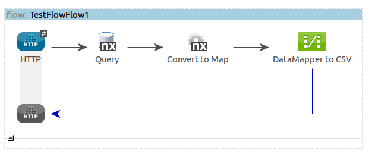
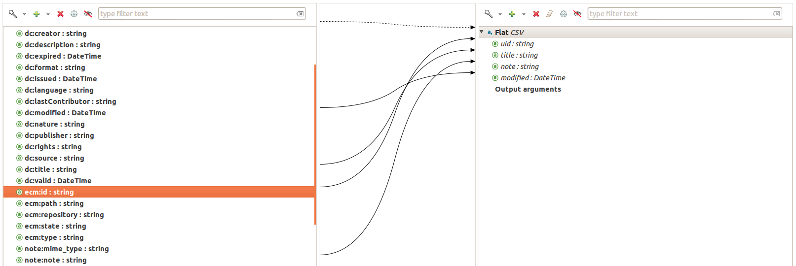

# Nuxeo Mule Connector and DataSense

Here are some notes about Nuxeo and Mule DataSense system.

## Nuxeo Objects

### Document and Documents objects
s
A lot of Nuxeo API will return a `Document` object.

A `Document` object is a java object with :

 - a set of fixed read-only fields :

      - getId()
      - getName()
      - getPath()
      - getState()
      - ...

 - a dynamic part returned as a `Map<String,Serializable>` via getProperties()

The structure of the dynamic part actually depends on the Document Type : each doc type is associated to a set a schemas and each schema contains a set of fields.

Nuxeo schemas are technically XSD schemas that supports scalars, multivalued fields and complex fields.

Here are some examples :

      document.getProperties().get("dc:description")

will return a `String`

      document.getProperties().get("dc:subjects")

will return a `List<String>`

      document.getProperties().get("file:content")

will return a `Blob` object (wrapper around a binary stream)

### Input objects

The `Document` object is never used as input of an API call :

 - either we simply send a reference : UUID or Path as String
 - or we only send a part of the Document : typically a part of the properties Map, only the part that needs to be changed

Typically, the `Document.Update` API will take as parameter a `PropertyMap` that can be constructed from a `Map<String,Serializable>` and contains only properties that must be changed.

## DataSense

### DataSense, Document, Map and converters

DataSense can not (for now) be directly used with native Document and Documents objects.

DataSense system require the underlying object to be a Map or List of Map, but Document and Documents are not : but the connector does provide converters for that matter.

Nuxeo Document properties have names containing `':'`, the naming convention being `schemaPrefix:fieldLocalName`.

Tests showed that DataSense and DataMapper had a problem with the `':'` char, so, when doing the Document to Map conversion, we also translate all field names to make it compliant with DataMapper.

Here are some simple examples :

     doc.getName()                                       
         => map.get("ecm:name")                 
                => map["ecm__name"]

     doc.getProperties().get("dc:description")           
         => map.get("dc:description")           
                => map["dc__description"]

     doc.getProperties().get("file:content").get("name") 
         => map.get("file:content").get("name") 
                => map["file:content"]["name"]

### Types exposed by the Connector

For now, for each Document Type defined on the server, Nuxeo Connector exposes as 1 *"DataSense type"*.

This means that for a Server that has 2 document types Note and File, Mule connector will expose 2 DataSense types File and Note.

This Mule Type object is similar to a big `Map<String,Object>`

 - DocumentModel object attributes are mapped as properties with the `ecm` namespace

        map.put("ecm__type", doc.getType());
        map.put("ecm__facets", doc.getFacets().list());
        map.put("ecm__id", doc.getId());
        map.put("ecm__lock", doc.getLock());
        map.put("ecm__lockCreated", doc.getLockCreated());
        map.put("ecm__lockOwner", doc.getLockOwner());
        map.put("ecm__path", doc.getPath());
        map.put("ecm__repository", doc.getRepository());
        map.put("ecm__state", doc.getState());

 - all the DataModel properties are added to the same map

    - dublincore properties will be accessible via : map.get("dc__title")
    - note properties will be accessible via : map.get("note__note")

### DataSense ByOperation vs ByType bindings

*DataSense allows to make Mule automatically guess what the input or return DataSense type of a method are.*

For Nuxeo API, so far we did not find a way to use this feature.

A lot of Nuxeo API method will return `Document` objects, but in most of the case there is no method parameter that can be used to "guess" what will be the return Doc Type.

For some methods the return type will actually be a list of Documents that can all have different types : the obvious example is a search.

This means that for now, we don't use the Method binding : we just let the user select the Types directly inside the DataMapper.

So, when creating a data mapper :

 - DataMapper input should be plugged to a converter that converts Document to Map (or Documents to List of Map)
 - Input type : Connector
 - Connector : Nuxeo
 - select "by Type" rather than "by Operation"
 - select (manually) the Doc type you want to use

## Known issues and open questions 

### Blob mapping

Currently Blob are mapped with DataSense using :

      DynamicObjectBuilder blobField = dynamicObject.addDynamicObjectField(DataSenseHelper.getDataSenseFieldName(prefix, name));
      blobField.addSimpleField("encoding", DataType.STRING);
      blobField.addSimpleField("mime-type", DataType.STRING);
      blobField.addSimpleField("name", DataType.STRING);
      blobField.addSimpleField("length", DataType.LONG);
      blobField.addSimpleField("digest", DataType.STRING);
      blobField.addSimpleField("data", DataType.STREAM);

The type DataType.STREAM seems to be deprecated : but what is the recommanded approach for Streams ?

### Field names, ":", Mapper and problems

Nuxeo fields names use prefix : `dc:description`, `file:content`, `note:note` ...

When exposing these fields via DataSense, it looks like the generated *'Mapper script'* looks something like : 

    output.dc_title = input.title;
    output.dc_description = input.desc;

NB : here the *"Nuxeo object"* is the output. 

Does this mean that `":"` are prohibited in field names ?

Here is a simple example flow :

     http endpoint > Nuxeo Query > DocumentModelToMap transformer > Mapper > CSV

    <flow name="TestFlowFlow1" doc:name="Test DataSense">
        <http:inbound-endpoint exchange-pattern="request-response" host="localhost" port="8081" doc:name="HTTP"/>
        <nuxeo:query config-ref="Nuxeo" query="select * from Note" doc:name="Query"/>
        <nuxeo:documents-to-list-of-map doc:name="Convert to Map"/>
        <data-mapper:transform config-ref="new_mapping_grf" doc:name="DataMapper to CSV"/>
    </flow>

The resulting MEL script is : 

    output.uid = input.ecm_id;
    output.title = input.dc_title;
    output.note = input.note_note;
    output.modified = input.dc_modified;

Of course it does not work, but in fact the underlying object is never called : so I don't recieve any `get` call even for a bad propertyname

